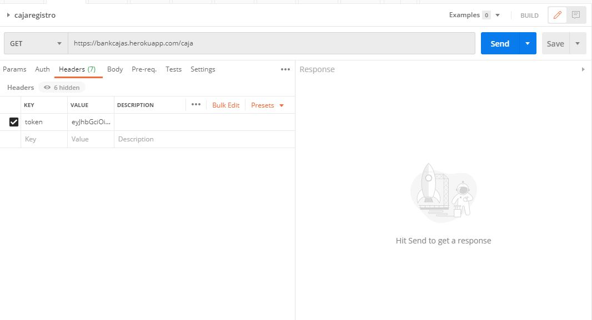

#  Rest Server \ Bank Caja

##👋 Desarollado por Carlos Andrade

- 💻 I’m a Software Engineering Student
- ✏️ I like to develop Web Applications
- 🎹 I love music and I play 8+ instruments

### Descripción
Esta  aplicación recibe turnos de las cajas donde se almacena la fecha  y  hora de cada turno y el número de caja.
La  aplicación implementa  la creación de usuarios cada uno de estos con un USER_ROLE

 

### Instalación:
Para la instalación de la API debemos tener  instalado:
- NodeJS
 

- MongoDB

- Postman

### Pasos para la instalción
- Clonar el repositorio de 
- Instalar las dependecias

_npm install_
- Ejecutar el codigo

_node server.js_

_nodemon server.js_

### Desplegado en Heroku
- Variables locales

_MONGO URI_ : En esta varibale se encuentra almacenada la base de datos mongo DB 

_SEED_ : Almacenamos la clave de producción
- link:  https://bankcajas.herokuapp.com/

.
# Uso

Par consumir el servicio se  utilizara POSTMAN

### POST
- Login

Ingresamos los datos del  usuario Administrador

- Uso del token

Copiamos el token generado en el logeo y en el apartado de head creamos la variabl token y pegamos el token esto realizamos para realizar cualquier acción dentro del la api

-  Registrar

Ingresamos el token y procedemos a ingrear los datos de registro

### GET
- Ver usuarios registrados

- Buscar caja  
Realizamos la busqueda por fecha

- Eliminar caja

Ingresamos el Id en el link

 

### Top Languages:

### Agradecimeinto

En agradecimineto al concimiento  impartido por el  Ing. Rodrigo Tufiño en la materia Desarollo de software 
